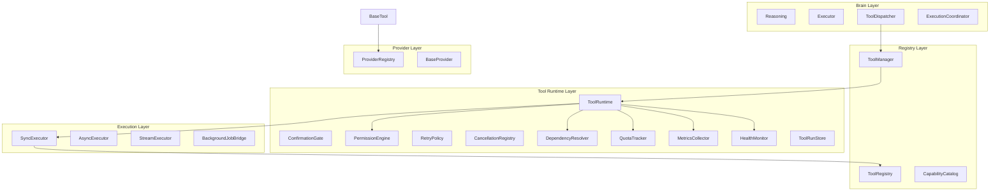

# Phase 10A — Real Tool Integration Framework

**Document type:** Executable engineering task breakdown  
**Phase:** Titan V3 — Phase 10A (Real Tool Integration Framework)  
**Target version:** v0.10.0  
**Date:** 2026-06-28  
**Status:** Phase 10A complete — Tool Runtime V2 enabled by default (v0.10.0)

**Builds on:** Phase 6 (`BaseTool`, `ToolRegistry`, `ToolPolicy`, `ToolDispatcher`), Phase 9 (`AutonomyPolicy`, `JobStore`/`JobRunner`)

---

## Extended Runtime Capabilities (Approved)

The Tool Runtime layer includes six operational dimensions designed in now, implemented incrementally across batches:

| Capability | Purpose | Batch |
|---|---|---|
| **Tool Health States** | Operational readiness per tool/provider | 1 (types), 2 (runtime), 5 (providers) |
| **Tool Metrics** | Execution observability | 1 (types), 2 (collection), 4 (persistence) |
| **Provider Versioning** | Compatibility and upgrade safety | 1 (types), 5 (providers) |
| **Execution Modes** | LIVE / PAPER / SIMULATION / MOCK safety envelope | 1 (types), 2 (runtime default), 5 (providers) |
| **Usage Quotas** | Optional rate/volume limits | 1 (types), 2 (enforcement stub), 4 (persistence) |
| **Dependency Graph** | Pre-flight dependency resolution | 1 (types), 2 (validation), 5 (registration) |

---

## 1. Architecture Overview

### Current state (baseline)

Phase 6 delivered a **synchronous, in-process** tool stack:

```
Reasoning → Executor.plan_tools() → ToolDispatcher → ToolManager → ToolRegistry → BaseTool.run()
```

### Target architecture

Introduce a **Tool Runtime Layer** between dispatch and execution. `ToolManager` remains the composition-root facade.



### Two-axis execution model

| Axis | Enum | Values | Meaning |
|---|---|---|---|
| **Transport** | `InvocationMode` | SYNC, ASYNC, STREAM, BACKGROUND | How the invocation is delivered |
| **Environment** | `ExecutionMode` | LIVE, PAPER, SIMULATION, MOCK | Side-effect and external-call envelope |

- **LIVE** — real external effects (default for production tools).
- **PAPER** — real reads, simulated writes (trading, order placement).
- **SIMULATION** — deterministic replay / recorded fixtures.
- **MOCK** — in-process stubs for tests and offline dev.

`ToolRuntime` resolves effective mode: `context override → user profile → global default (settings)`.

---

## 2. Tool Health States

```python
class ToolHealthState(str, Enum):
    ONLINE = "online"       # fully operational
    OFFLINE = "offline"     # unavailable (provider down, credentials missing)
    DEGRADED = "degraded"   # partial capability (rate-limited, stale cache)
    DISABLED = "disabled"   # administratively disabled (feature flag, policy)
    UNKNOWN = "unknown"     # not yet probed since startup
```

### Health resolution order

1. Tool-level override (`ToolCapability.health_state`)
2. Provider `health_check()` result
3. Dependency graph — if required dependency OFFLINE → tool OFFLINE
4. Feature flag / user policy DISABLED
5. Default UNKNOWN until first probe or execution attempt

### Health monitor (Batch 2+)

`HealthMonitor` aggregates per-tool and per-provider health. Pre-execution: if health is OFFLINE or DISABLED, `ToolRuntime` returns `ToolRunOutcome` with `FAILED` and `ProviderUnavailable` without invoking the tool.

DEGRADED: execute with warning appended to audit log; Brain may surface degraded notice in prompt.

---

## 3. Tool Metrics

```python
@dataclass
class ToolMetrics:
    execution_count: int = 0
    average_runtime_ms: float = 0.0
    success_rate: float = 1.0
    error_count: int = 0
    timeout_count: int = 0
    last_execution_at: str | None = None  # ISO-8601 UTC
```

### Collection rules

- `MetricsCollector` updates in-memory counters on every terminal run (Batch 2).
- Rolling average runtime: Welford or exponential moving average.
- Success rate = successes / execution_count (0.0 if count is 0).
- Persisted snapshot in `data/tool_metrics.json` optional (Batch 4).
- Exposed via `CapabilityCatalog.export()` for dashboard (Phase 12).

Metrics never include raw params or secrets.

---

## 4. Provider Versioning

Every provider must expose version and compatibility metadata:

```python
@dataclass(frozen=True)
class ProviderVersionInfo:
    provider_id: str
    version: str                    # semver, e.g. "1.2.0"
    min_runtime_version: str        # minimum Titan tool-runtime version
    api_version: str | None = None  # external API version if applicable
    compatible_modes: frozenset[ExecutionMode] = frozenset({ExecutionMode.LIVE})
    changelog_url: str | None = None
```

### Registration validation (Batch 5)

- `ProviderRegistry.register()` rejects providers whose `min_runtime_version` exceeds current `TOOL_RUNTIME_VERSION` from settings.
- Tools declare `provider_name`; runtime logs version mismatch as DEGRADED health.
- Version info included in audit events (`provider_version` field).

---

## 5. Execution Modes (Environment)

See §1 two-axis model. Mode affects:

| Mode | External API | Writes | Trading orders |
|---|---|---|---|
| LIVE | Real | Real | Real (with confirmation) |
| PAPER | Real reads | Simulated | Simulated fills |
| SIMULATION | Fixtures | In-memory | Replay engine |
| MOCK | Stub responses | No-op | No-op |

`ToolExecutionContext.execution_mode` overrides session default. Trading tools default to PAPER unless explicitly LIVE + confirmed.

---

## 6. Usage Quotas

```python
@dataclass(frozen=True)
class UsageQuota:
    max_invocations: int | None = None      # per window
    max_invocations_per_day: int | None = None
    max_concurrent: int | None = None
    window_seconds: int = 86400

@dataclass
class QuotaUsage:
    invocations_in_window: int = 0
    window_started_at: str | None = None
    daily_count: int = 0
    daily_reset_at: str | None = None
```

`QuotaTracker` (Batch 2):

- Optional per-tool quotas in `ToolCapability.quota`.
- Global defaults in settings (`TITAN_TOOL_QUOTA_ENABLED`).
- Pre-execution: if exceeded → `ToolPermissionDenied` with French message.
- Audit event `quota_exceeded`.

---

## 7. Dependency Graph

```python
@dataclass(frozen=True)
class ToolDependency:
    ref_type: str   # "tool" | "provider" | "service"
    ref_id: str
    required: bool = True

class DependencyGraph:
    def register_tool(self, name: str, deps: tuple[ToolDependency, ...]) -> None: ...
    def check(self, tool_name: str, *, health: HealthMonitor, registry: ToolRegistry) -> DependencyCheckResult: ...
```

### Pre-execution validation (Batch 2)

Before `SyncExecutor` runs:

1. Resolve declared dependencies from `ToolCapability.dependencies`.
2. For `ref_type=tool`: target must be registered and not DISABLED.
3. For `ref_type=provider`: provider must exist and health ≠ OFFLINE.
4. For `ref_type=service`: abstract service slot (e.g. `"network"`, `"filesystem"`) checked against runtime service registry (future).

Failure → `ToolRunOutcome(FAILED)` with `dependency_unavailable` error code; no partial execution.

Circular dependencies detected at registration time (fail fast at startup).

---

## 8. Required Modules and Folders

```
tools/
├── tool_schema.py               # ToolParameter, ToolSchema
├── tool_enums.py                # ToolHealthState, InvocationMode, ExecutionMode, RiskLevel
├── tool_capability.py           # ToolCapability metadata
├── tool_metrics.py              # ToolMetrics, MetricsCollector (stub Batch 1)
├── tool_dependency.py           # ToolDependency, DependencyGraph
├── tool_quota.py                # UsageQuota, QuotaTracker (stub Batch 1)
├── provider_version.py          # ProviderVersionInfo
├── tool_run_models.py           # ToolRun, ToolEvent, ToolRunOutcome
├── tool_result.py               # EVOLVE
├── tool_runtime.py              # NEW Batch 2
├── permission_engine.py         # NEW Batch 2
├── confirmation_gate.py         # NEW Batch 3
├── retry_policy.py              # NEW Batch 2
├── cancellation_registry.py     # NEW Batch 4
├── tool_run_store.py            # NEW Batch 4
├── executors/                   # NEW Batch 2+
├── providers/                   # NEW Batch 5
├── adapters/                    # NEW Batch 2
└── audit/                       # NEW Batch 4

core/
├── exceptions.py                # Tool error hierarchy (Batch 1)

config/settings.py               # EVOLVE each batch
```

---

## 9. Required Interfaces (Summary)

Full interface definitions from original plan remain valid. Additions:

### `ToolCapability` (extended)

```python
@dataclass(frozen=True)
class ToolCapability:
    name: str
    description: str
    parameters: tuple[ToolParameter, ...]
    invocation_mode: InvocationMode = InvocationMode.SYNC
    execution_mode: ExecutionMode = ExecutionMode.LIVE  # default env mode
    supported_execution_modes: frozenset[ExecutionMode] = frozenset({ExecutionMode.LIVE})
    risk_level: RiskLevel = RiskLevel.SAFE
    health_state: ToolHealthState = ToolHealthState.UNKNOWN
    dependencies: tuple[ToolDependency, ...] = ()
    quota: UsageQuota | None = None
    # ... existing fields (risk, confirmation, timeout, retries, provider_name, tags)
```

### `BaseProvider` (extended)

```python
class BaseProvider(ABC):
    @property
    def version_info(self) -> ProviderVersionInfo: ...

    def health_check(self) -> ProviderHealth: ...  # includes ToolHealthState
```

### `ToolRuntime.invoke()` (extended pre-flight)

```
validate params
→ resolve execution mode
→ DependencyGraph.check()
→ QuotaTracker.check()
→ HealthMonitor.assert_ready()
→ PermissionEngine.evaluate()
→ ConfirmationGate (if needed)
→ execute with MetricsCollector.observe()
```

---

## 10–12. Security, Permissions, Registration, Execution, Errors, Async, Audit

Unchanged from approved plan except:

- Permission axis adds **quota** and **health** gates.
- Audit events add: `health_state`, `execution_mode`, `provider_version`, `quota_remaining`, `dependencies_checked`.
- Provider stubs document required `version_info` and supported execution modes.

---

## Implementation Order

### Batch 1 — Foundation types and exceptions ✅ COMPLETE

1. `core/exceptions.py`
2. `tools/tool_schema.py` — extract from `base_tool.py`
3. `tools/tool_enums.py` — shared enums (health, invocation, execution modes)
4. `tools/tool_capability.py` — capability dataclass
5. `tools/tool_metrics.py`
6. `tools/tool_dependency.py`
7. `tools/tool_quota.py`
8. `tools/provider_version.py`
9. `tools/tool_run_models.py`
10. `tools/tool_result.py` — extend (backward compat)
11. `config/settings.py` — runtime paths, modes, quotas
12. Tests: `tests/test_tool_runtime_models.py` (20 cases)

**Exit criteria:** All existing tests pass unchanged. ✅ 379 passed.

---

### Batch 2 — Runtime core + legacy adapter

1. `MetricsCollector`, `HealthMonitor`, `DependencyResolver` (functional)
2. `QuotaTracker` (enforcement)
3. `tools/adapters/legacy_tool_adapter.py`
4. `tools/executors/sync_executor.py`
5. `tools/permission_engine.py`, `retry_policy.py`, `tool_runtime.py`
6. Feature flag `TITAN_TOOL_RUNTIME_V2`

---

### Batch 3 — Confirmation + permission wiring

(Unchanged from original plan)

---

### Batch 4 — Persistence, audit, async ✅ COMPLETE

Includes optional `data/tool_metrics.json` snapshot.

1. `tools/audit/` — `ToolAuditEvent`, `ToolAuditLogger`
2. `tools/tool_run_store.py` — JSON run persistence
3. `tools/cancellation_registry.py`
4. `tools/executors/async_executor.py` — thread-pool foundation
5. Metrics/quota persistence on `MetricsCollector` / `QuotaTracker`
6. `ToolRuntime` wired: audit, store, poll/cancel, async path
7. Tests: `test_tool_run_store.py`, `test_tool_audit.py`, `test_tool_persistence_async.py`

**Exit criteria:** All existing tests pass; +14 new tests. ✅ 427 passed.

---

### Batch 5 — Provider framework + stubs ✅ COMPLETE

Each stub implements `version_info` and `health_check()`.

1. `tools/providers/` — `BaseProvider`, `ProviderRegistry`, stubs
2. Refactor `WebSearchTool` / `web_search_provider` (reference pattern)
3. Wire registry into `ToolRuntime`, `ToolManager`, audit, health
4. Tests: `test_provider_framework.py` (+16 cases)

**Exit criteria:** All existing tests pass; provider versioning enforced at registration. ✅

---

### Batch 6 — Brain integration hardening ✅ COMPLETE

1. `brain/tool_execution_bridge.py` — dispatch context mapping
2. `brain/tool_confirmation_handler.py` — `/confirm` end-to-end flow
3. `tools/tool_status_formatter.py` — provider health for prompts
4. Wire Brain → ExecutionCoordinator → ToolDispatcher → ToolRuntime
5. Pipeline stages: `tool_confirmation_commands`, `load_tool_status`
6. `PromptBuilder` section: `SANTÉ OUTILS ET PROVIDERS`
7. Tests: `test_brain_tool_integration.py` (+12 cases)

**Exit criteria:** Provider health in prompts; confirmation preserved; backward compat when v2 off. ✅

---

### Batch 7 — Phase closure / Definition of Done ✅ COMPLETE

1. Enable `TITAN_TOOL_RUNTIME_V2=true` as default in `config/settings.py`
2. Bump application `VERSION` to `0.10.0`
3. Run full DoD verification (execution modes, confirmation, audit, persistence, providers, Brain)
4. Update `.env.example`, `CHANGELOG.md`, engineering rulebook (`titan.mdc`)
5. Regression: Phase 6 tool tests pass under v2 default; legacy opt-out via `use_runtime_v2=False` or env

**Exit criteria:** All DoD items checked; ≥40 Phase 10A tests; 455+ total tests pass. ✅

---

**Status:** Phase 10A complete — Tool Runtime V2 enabled by default (v0.10.0)

## Risks (Additional)

| Risk | Mitigation |
|---|---|
| ExecutionMode vs InvocationMode confusion | Document two-axis model; consistent naming in code |
| Quota state lost on restart | Batch 4 persistence; in-memory OK for 10A |
| Dependency cycles | Topological sort at registration |
| Health flapping | Hysteresis / cooldown before OFFLINE→ONLINE (Batch 2) |

---

## Definition of Done (Phase 10A)

- [x] All six extended capabilities designed and typed (Batch 1)
- [x] Health, metrics, dependencies, quotas enforced at runtime (Batch 2–4)
- [x] Provider versioning on all providers (Batch 5)
- [x] Execution modes LIVE/PAPER/SIMULATION/MOCK respected (Batch 2+)
- [x] Original DoD items from approved plan (runtime, confirmation, audit, stubs)
- [x] ≥40 new tests; all Phase 6 tool tests pass (455 total, 96 Phase 10A-specific)

### DoD verification (Batch 7 — 2026-06-28)

| Area | Status | Evidence |
|------|--------|----------|
| Tool Runtime V2 default | PASS | `TITAN_TOOL_RUNTIME_V2` default `true`; `ToolManager.runtime` wired at composition root |
| Execution modes | PASS | `test_tool_runtime_models.py`, `test_confirmation_gate.py` (LIVE/MOCK/PAPER) |
| Confirmation flow | PASS | `test_confirmation_gate.py` (12), `test_brain_tool_integration.py` `/confirm` (12) |
| Audit logging | PASS | `test_tool_audit.py` (3), provider audit in `test_provider_framework.py` |
| Persistence | PASS | `test_tool_run_store.py`, `test_tool_persistence_async.py` (optional disk via flags) |
| Provider framework | PASS | `test_provider_framework.py` (15); stubs only — no external APIs |
| Brain integration | PASS | `test_brain_tool_integration.py`; `SANTÉ OUTILS ET PROVIDERS` in prompts |
| Backward compatibility | PASS | `use_runtime_v2=False` or `TITAN_TOOL_RUNTIME_V2=false` preserves Phase 6 path |
| Capability-first architecture | PASS | `CapabilityCatalog`, `ToolCapability`, provider-agnostic confirmation |

---

## Out of Scope (Phase 10B+)

Real external integrations, LLM function calling, dashboard WebSocket, credential vault, asyncio project-wide migration.
